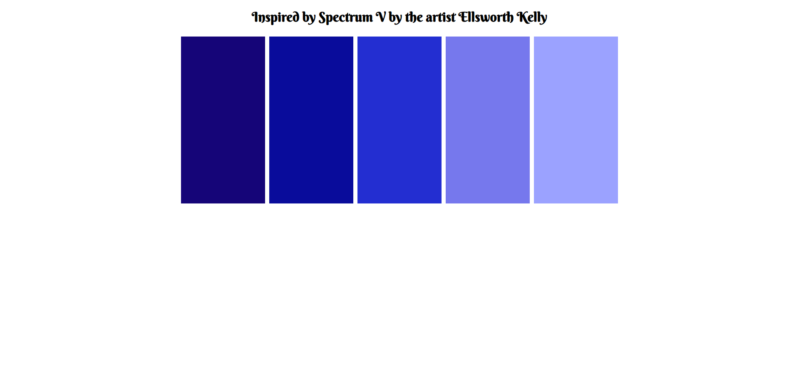

# Web_Development
Various Web Development stuff

This is a repository of my personal projects for Web Development.

Quick Summary of Projects
1. Two_Spectrum: Simple HTML and CSS site created with tables
2. Startup_FrontEnd: More in depth Front End that asks for a form submission to a thank you page with CSS styling.
3. Coffee Lovers: Front End Only that uses Bootstrap as it's design Framework
4. TicTacToe: Simple game implemented with JavaScript

Future TODO: 
Learn more about Bootstrap

Below are some examples of Projects I have worked on so far. You can also view more images under the Images folder in this repository.

